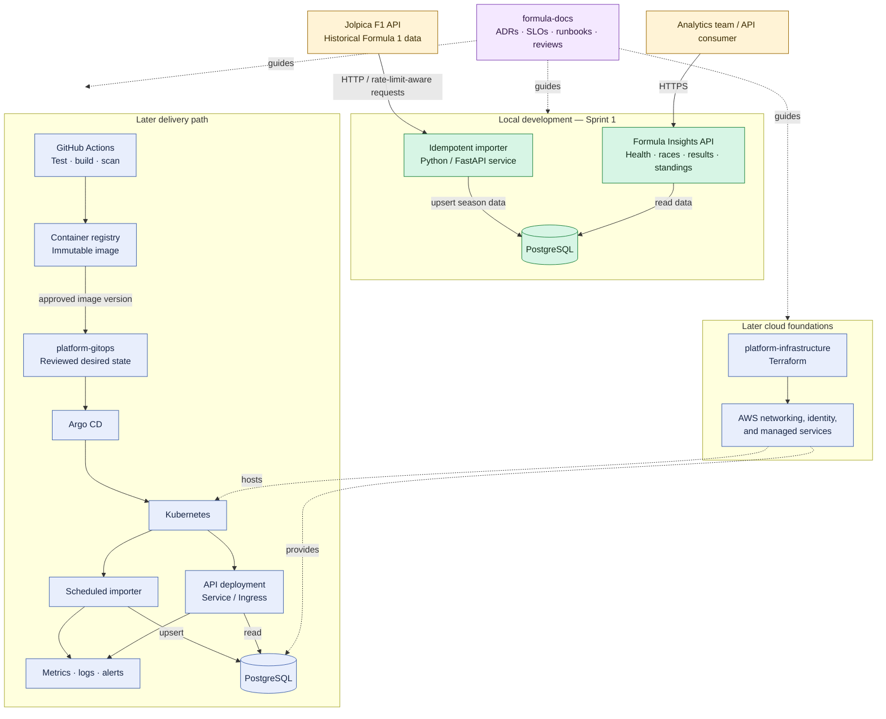

# Formula Insights architecture

This diagram shows the target Release 1 direction. The highlighted local slice
is the current implementation focus; Kubernetes, GitOps, and AWS are later
stages and are not required to run the service locally.

## Repository ownership

| Area | Repository |
| --- | --- |
| API, importer, database model, image build | `formula-insights-api` |
| Kubernetes desired state and approved image versions | `platform-gitops` |
| Terraform-managed foundations | `platform-infrastructure` |
| Decisions, SLOs, diagrams, runbooks, reviews | `formula-docs` |
